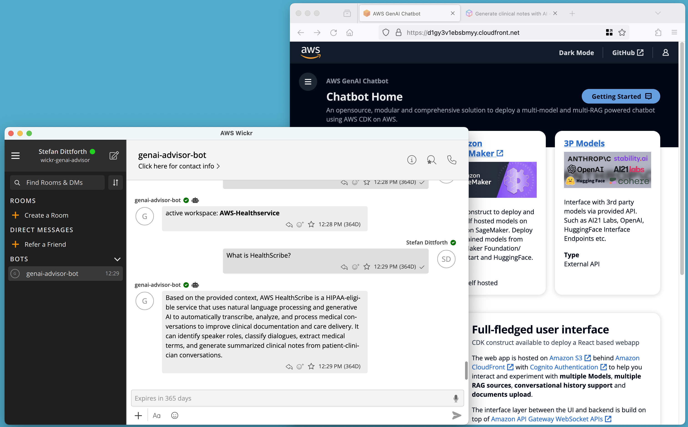
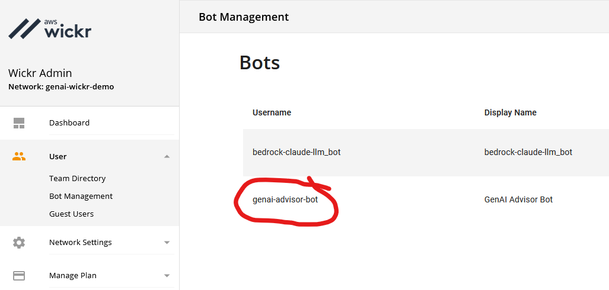
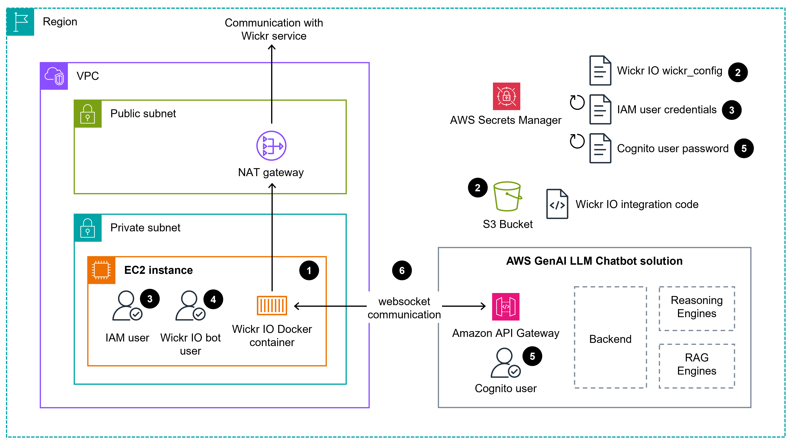

# Intégration de Wickr IO et AWS GenAI Chatbot

Ce projet fournit une démonstration de l'intégration du [client de messagerie sécurisé Wickr](https://wickr.com/)
avec le backend [AWS GenAI LLM Chatbot](https://github.com/aws-samples/aws-genai-llm-chatbot). AWS GenAI LLM 
Chatbot est un projet open source permettant d'expérimenter avec divers modèles de langage larges (LLM) et 
modèles de langage multimodaux, paramètres et invites dans votre propre compte AWS.

De plus, le projet sert d'exemple pour un déploiement entièrement automatisé du conteneur docker Wickr IO et 
du code d'intégration. Le déploiement utilise le [AWS Cloud Development Kit (CDK)](https://aws.amazon.com/cdk/). Pour 
obtenir des conseils sur le développement de vos propres intégrations Wickr IO, veuillez vous référer à la 
[documentation Wickr IO](https://wickrinc.github.io/wickrio-docs/#wickr-io).

[<p align="center"></p>]()

La solution AWS GenAI LLM Chatbot offre une interface utilisateur pratique pour sélectionner des LLM et créer des 
espaces de travail pour la [génération augmentée par récupération (RAG)](https://aws.amazon.com/what-is/retrieval-augmented-generation/). RAG est une technologie permettant d'augmenter les LLM avec des sources de connaissances supplémentaires. 
Le code d'intégration Wickr IO communique avec l'API d'AWS GenAI LLM Chatbot pour récupérer des réponses aux messages 
envoyés via le messager Wickr.

## Expérience utilisateur final

Regardez la vidéo ci-dessous pour avoir une impression de l'expérience utilisateur avant de déployer le projet.

https://github.com/aws-samples/secure-messenger-genai-chatbot/assets/149990130/10e31a61-1a7b-4c70-803e-d4c00c07bcac

## Prérequis

### Déployer AWS GenAI LLM Chatbot

Ce projet dépend d'un déploiement et d'une configuration réussis de la solution [AWS GenAI LLM Chatbot](https://github.com/aws-samples/aws-genai-llm-chatbot)
. Veuillez suivre les instructions ci-dessous avant de déployer l'intégration Wickr IO 
(décrite dans la section [Déploiement](#déploiement)).

1. Suivez les instructions décrites dans la section [Déployer](https://aws-samples.github.io/aws-genai-llm-chatbot/guide/deploy.html#aws-cloud9)
de la solution AWS GenAI LLM Chatbot.
2. Lors de la sélection des fonctionnalités avec `npm run config`, la configuration suivante est suggérée :
```shell
✔ Prefix to differentiate this deployment · 
✔ Do you want to use existing vpc? (selecting false will create a new vpc) (y/N) · false
✔ Do you want to deploy a private website? I.e only accessible in VPC (y/N) · false
✔ Do you want to provide a custom domain name and corresponding certificate arn for the public website ? (y/N) · false
✔ Do want to restrict access to the website (CF Distribution) to only a country or countries? (y/N) · false
✔ Do you have access to Bedrock and want to enable it (Y/n) · true
✔ Region where Bedrock is available · us-east-1
✔ Cross account role arn to invoke Bedrock - leave empty if Bedrock is in same account · 
✔ Do you want to use any Sagemaker Models (y/N) · false
✔ Do you want to enable RAG (Y/n) · true
✔ Which datastores do you want to enable for RAG · opensearch
✔ Select a default embedding model · cohere.embed-multilingual-v3
```

### Créer le compte client Wickr IO

Le code d'intégration Wickr IO nécessite un compte client Wickr - alias "compte bot". Veuillez 
créer le compte client Wickr en suivant les instructions du guide Wickr IO, 
[section "Création de client Wickr IO"](https://wickrinc.github.io/wickrio-docs/#configuration-wickr-io-client-creation). Stockez l'identifiant utilisateur et le mot de passe que vous venez de créer dans un 
gestionnaire de mots de passe. Ces informations sont nécessaires dans la section suivante pour le déploiement de l'intégration 
Wickr IO.

IMPORTANT : N'utilisez pas le caractère barre oblique inverse ` \ ` dans le mot de passe du compte client Wickr IO. 
La procédure d'installation automatique du conteneur WickrIO lit le mot de passe depuis AWS Secrets Manager. Une barre 
oblique inverse dans la configuration est interprétée comme un caractère d'échappement. Cela entraîne un échec de 
connexion lors du démarrage du conteneur Wickr IO.

[<p align="center"></p>]()

## Déploiement

Cette section décrit le déploiement de l'intégration Wickr IO. Toutes les commandes ci-dessous sont exécutées dans un 
[environnement Cloud9](https://eu-west-1.console.aws.amazon.com/cloud9control/home?region=eu-west-1#/) avec Ubuntu. Vous
pouvez réutiliser l'instance Cloud9 utilisée pour le [Déploiement d'AWS GenAI LLM Chatbot](#Déploiement-dAWS-GenAI-LLM-Chatbot).

Il est recommandé de déployer dans la région AWS Irlande (eu-west-1). Le projet a été testé dans cette région.

1. Clonez le dépôt de code dans votre environnement Cloud9 :

```shell
git clone https://github.com/aws-samples/secure-messenger-genai-chatbot.git
cd secure-messenger-genai-chatbot
```

2. Activez l'environnement virtuel Python et installez toutes les bibliothèques requises :
```shell
python -m venv .venv
. ./.venv/bin/activate
python -m ensurepip --upgrade
python -m pip install --upgrade pip
python -m pip install --upgrade virtualenv
pip install -r requirements.txt
```

2. Initialisez l'environnement CDK. Si vous travaillez régulièrement avec CDK, vous avez peut-être déjà fait cette étape.  
```shell
cdk bootstrap
```

3. Exécutez la commande suivante pour déployer le projet. Remplacez `WickrClientAccount` et `WickrClientPassword` par 
l'identifiant utilisateur et le mot de passe que vous avez créés à l'étape [Créer le compte client Wickr IO](#Créer-le-compte-client-Wickr-IO). Placez le 
mot de passe entre guillemets.
```shell
cdk deploy --all --context bot_user_id="WickrClientAccount" --context bot_password="WickrClientPassword" --require-approval never --no-prompts
```

Le déploiement prend environ 5 minutes pour se terminer.

## Dépannage

En cas de problèmes, il est recommandé de vérifier les fichiers journaux du code d'intégration Wickr IO à la 
recherche de messages d'erreur. Les fichiers journaux sont écrits sur l'instance EC2 qui exécute le conteneur docker 
Wickr IO. Utilisez SSM Session Manager pour accéder à la console de l'instance. 
Vérifiez les fichiers journaux suivants :
```shell
/opt/WickrIO/clients/<wickr bot user ID>/integration/<wickr bot user ID>/:
wpm2.output

/opt/WickrIO/clients/<wickr bot user ID>/integration/<wickr bot user ID>/logs/
error.output
log.output
```

## Nettoyage

Toutes les ressources seront détruites en exécutant la commande suivante :
```shell
cdk destroy --all
```

## Architecture

Le code CDK de ce projet déploie l'architecture représentée ci-dessous. Veuillez noter que ce projet ne déploie que les composants Wickr IO. La solution AWS GenAI LLM Chatbot doit être déployée 
en premier. Voir également la section [Prérequis](#prérequis).

[<p align="center"></p>]()

1. Suivant les recommandations [SEC05-BP01 Créer des couches réseau](https://docs.aws.amazon.com/wellarchitected/latest/security-pillar/sec_network_protection_create_layers.html),
l'instance EC2 avec le conteneur docker Wickr IO est placée dans un sous-réseau privé. La communication avec le service Wickr
se fait via une passerelle NAT.
2. Le projet utilise la fonctionnalité Wickr IO de récupération des informations de configuration à partir d'AWS Secrets Manager et de 
récupération du code d'intégration personnalisé à partir de S3. La configuration et le code sont récupérés au démarrage du conteneur docker 
Wickr IO. Pour plus d'informations, veuillez consulter la documentation Wickr IO [Configuration Automatique](https://wickrinc.github.io/wickrio-docs/#automatic-configuration).
3. L'accès au Secret contenant la configuration Wickr IO et le code d'intégration personnalisé dans S3 est contrôlé via un 
utilisateur IAM. Les identifiants IAM sont stockés dans AWS Secrets Manager et sont automatiquement pivotés régulièrement 
([SEC02-BP05 Auditer et faire pivoter les identifiants périodiquement](https://docs.aws.amazon.com/wellarchitected/latest/security-pillar/sec_identities_audit.html)).
Après une rotation de secret, l'instance EC2 doit être redémarrée. 
L'ID de clé d'accès AWS et la clé d'accès secrète de l'utilisateur IAM sont installés dans le répertoire `~/.aws` sur l'instance EC2 
au redémarrage.
4. Le code d'intégration personnalisé Wickr IO nécessite un utilisateur bot Wickr IO pour communiquer avec le 
service Wickr (voir également la documentation Wickr IO [Création de client Wickr IO](https://wickrinc.github.io/wickrio-docs/#configuration-wickr-io-client-creation)).
Les identifiants de l'utilisateur bot Wickr IO sont fournis lors de `cdk deploy` via les paramètres `--context` (voir également [Déploiement](#déploiement)). 
Veuillez noter que les identifiants de l'utilisateur bot Wickr IO ne sont pas automatiquement pivotés. Une rotation régulière manuelle via la console 
d'administration Wickr est recommandée ([Création de client Wickr IO](https://wickrinc.github.io/wickrio-docs/#configuration-wickr-io-client-creation)). 
5. Pour la communication avec la solution AWS GenAI LLM Chatbot, un utilisateur Cognito est généré lors du déploiement dans le pool 
d'utilisateurs Cognito de la solution AWS GenAI LLM Chatbot. Le mot de passe de cet utilisateur est stocké dans AWS Secrets Manager et 
est automatiquement pivoté régulièrement.
6. Après le déploiement, l'utilisateur utilise le logiciel client Wickr pour initier une conversation avec l'utilisateur bot Wickr IO. Ensuite,
le code d'intégration personnalisé s'exécutant dans le conteneur docker Wickr IO s'authentifie auprès d'AWS GenAI LLM Chatbot en utilisant
l'utilisateur Cognito. Après une authentification réussie, les messages sont échangés via l'API GraphQL AppSync.

## Sécurité

Consultez [CONTRIBUTION](CONTRIBUTING.md#security-issue-notifications) pour plus d'informations.

## Licence

Cette bibliothèque est sous licence MIT-0. Consultez le fichier [LICENSE](LICENSE).

## Contributeurs

 - [Stefan Dittforth](https://www.linkedin.com/in/stefandittforth/)
 - Charles H.
 - [Otto Kruse](https://www.linkedin.com/in/ockruse/)

## Avertissements

AWS ne représente ni ne garantit que ce contenu AWS est prêt pour la production. Vous êtes 
responsable de votre propre évaluation indépendante des informations, des conseils, du code et 
des autres contenus AWS fournis par AWS, ce qui peut inclure la réalisation de vos propres tests 
indépendants, la sécurisation et l'optimisation. Vous devez prendre des mesures indépendantes pour 
vous assurer que vous respectez vos propres pratiques et normes de contrôle qualité, et pour vous 
assurer que vous respectez les règles, lois, réglementations, licences et conditions locales qui 
vous sont applicables ainsi qu'à votre contenu. Si vous êtes dans un secteur réglementé, vous 
devez prendre des précautions supplémentaires pour vous assurer que votre utilisation de ce contenu 
AWS, combinée à votre propre contenu, est conforme aux réglementations applicables (par exemple, 
la loi sur la portabilité et la responsabilité des assurances maladie de 1996). AWS ne fait aucune 
déclaration, garantie ou assurance que ce contenu AWS aboutira à un résultat ou un aboutissement particulier.
