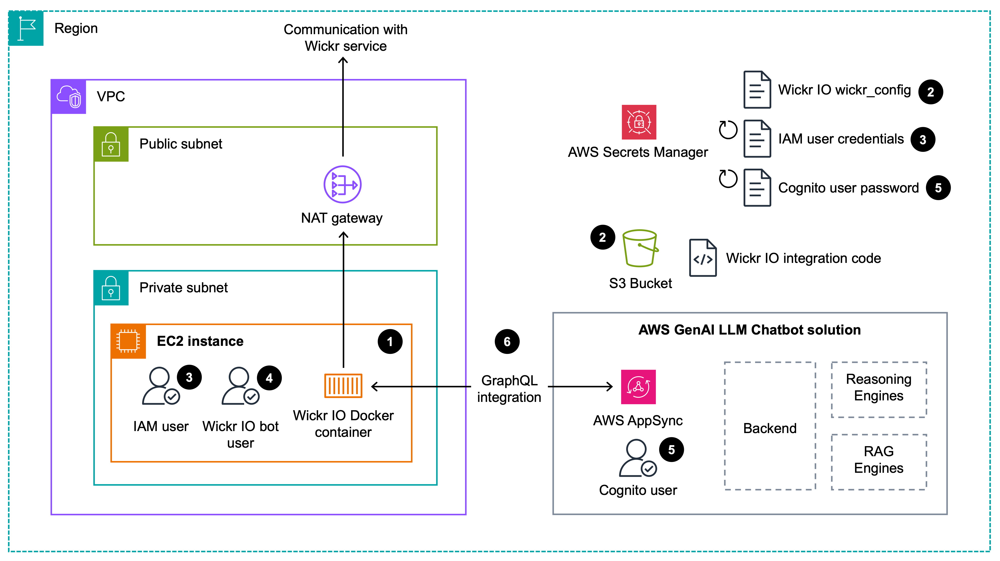

# Wickr IO and AWS GenAI Chatbot integration

This project provides a demonstration for the integration of the [Wickr secure messaging client](https://wickr.com/)
with the [AWS GenAI LLM Chatbot](https://github.com/aws-samples/aws-genai-llm-chatbot) backend. AWS GenAI LLM 
Chatbot is an open source project for experimenting with a variety of large Language models (LLM) and multimodal 
language models, settings and prompts in your own AWS account.

Furthermore, the project serves as an examples for a fully automated deployment of the Wickr IO docker container and 
the integration code. The deployment utilizes the [AWS Cloud Development Kit (CDK)](https://aws.amazon.com/cdk/). For 
guidance for developing your own Wickr IO integrations, please refer to the [Wickr IO documentation](https://wickrinc.github.io/wickrio-docs/#wickr-io).

[<p align="center"></p>]()

The AWS GenAI LLM Chatbot solution provides a convenient user interface to select LLMs and create workspaces for
[retrieval-augmented generation (RAG)](https://aws.amazon.com/what-is/retrieval-augmented-generation/). The Wickr IO 
integration code communicates with the websocket API of the AWS GenAI LLM Chatbot to retrieve responses for messages 
send via the Wickr messenger.

## Architecture

The CDK code in this project deploys the architecture depicted below. Please note, this project only deploys the Wickr IO components. The AWS GenAI LLM Chatbot solution must be deployed 
first. See also section [Prequisites](#prerequisites).

[<p align="center"></p>]()

1. Following guideline [SEC05-BP01 Create network layers](https://docs.aws.amazon.com/wellarchitected/latest/security-pillar/sec_network_protection_create_layers.html),
the EC2 instance with the Wickr IO docker container is placed in a private subnet. Communication to the Wickr service
is through a NAT gateway.
2. The project makes use of the Wickr IO feature to pull the configuration information from AWS Secrets Manager and to 
to pull the custom integration code from S3. Configuration and code is pulled at startup of the Wickr IO docker 
container. For more information please see the Wickr IO documentation [Automatic Configuration](https://wickrinc.github.io/wickrio-docs/#automatic-configuration).
3. Access to the Secret that holds the Wickr IO configuration and the custom integration code in S3, is controlled via an 
IAM user. The IAM credentials are stored in AWS Secrets Manager and rotated automatically on a regular basis 
([SEC02-BP05 Audit and rotate credentials periodically](https://docs.aws.amazon.com/wellarchitected/latest/security-pillar/sec_identities_audit.html)).
After a secret rotation, the EC2 instance needs to be rebooted. 
The IAM user's AWS access key ID and secret access key are installed in the `~/.aws` directory on the EC2 instance 
at reboot.
4. The Wickr IO custom integration code requires a Wickr IO bot user in order to communicate with the Wickr 
service (see also the Wickr IO documentation [Wickr IO Client Creation](https://wickrinc.github.io/wickrio-docs/#configuration-wickr-io-client-creation)).
The Wickr IO bot user credentials are provided during `cdk deploy` via `--context` parameters (see also [Deployment](#deployment)). 
Please note, the Wickr IO bot user credentials are not rotated automatically. A regular, manual rotation via the Wickr
admin console is recommended ([Wickr IO Client Creation](https://wickrinc.github.io/wickrio-docs/#configuration-wickr-io-client-creation)). 
5. For communication with the AWS GenAI LLM Chatbot solution a Cognito user is generated during deployment in the Cognito 
user pool of the AWS GenAI LLM Chatbot solution. The password for this user is stored in AWS Secrets Manager and rotated
automatically on a regular basis.
6. After deployment, the user uses the Wickr client software to initiate a conversation with the Wickr IO bot user. Then,
the custom integration code running in the Wickr IO docker container authenticates to the AWS GenAI LLM Chatbot using
the Cognito user. After successful authentication, messages are exchanged via the websocket channel.

## Prerequisites

### Deployment of the AWS GenAI LLM Chatbot

This project is dependent on a successful deployment and configuration of the [AWS GenAI LLM Chatbot](https://github.com/aws-samples/aws-genai-llm-chatbot)
solution. Please follow the instructions below before deploying the Wickr IO and AWS GenAI Chatbot integration 
(described in section [Deployment](#deployment)).

1. Follow the instructions outlined in the [Deploy](https://aws-samples.github.io/aws-genai-llm-chatbot/guide/deploy.html#aws-cloud9) section
of the AWS GenAI LLM Chatbot solution.
2. During selection of the features, ensure you select the "Llama2_13b_Chat" SageMaker model:
```shell
...
? Which SageMaker Models do you want to enable …  SPACE to select, ENTER to confirm selection [denotes instance size to host model]
...
✔ Llama2_13b_Chat [ml.g5.12xlarge]
...
```
3. ... and enable RAG and "Kendra (managed)" as data store:
```shell
...
✔ Do you want to enable RAG (y/N) · true
? Which datastores do you want to enable for RAG …  SPACE to select, ENTER to confirm selection
...
✔ Kendra (managed)
...
```
4. After successful deployment, start the web user interface of the AWS GenAI Chatbot and navigate to the "Retrieval-Augmented 
Generation (RAG)" menu and select "Workspaces". Create a new Amazon Kendra workspace with the name 
"WickrIO-Bot-Advisor". Please use exactly this name. The Wickr IO integration uses this name to select a RAG 
workspace.

[<p align="center"></p>]()

4. You can now upload documents to the "WickrIO-Bot-Advisor" workspace. These documents will be references by the LLM 
as an authoritative knowledge base outside its training data sources before generating a response. If you wish to
recreate the response shown in the [Introduction](#introduction) section, use this document: [AposHealth for knee osteoarthritis](https://www.nice.org.uk/guidance/mtg76).
This document provides evidence-based recommendations for healthcare practitioners related to knee osteoarthritis. It
serves as an example for specialised knowledge that was not part of the data sources when training an LLM.

[<p align="center"></p>]()

5. Don't forget to "Start Kendra Data Sync".

**Reminder:** please make sure you select the "Llama2_13b_Chat" SageMaker model during selection of the features and 
name the RAG workspace "WickrIO-Bot-Advisor". The Wickr IO integration is dependent on these names to communicate with
the chatbot backend.

### Create Wickr IO client account

The Wickr IO integration code requires a Wickr client account - aka "bot" account. Please create the Wickr client 
account follow the instructions in the Wickr IO guide, [section "Wickr IO Client Creation"](https://wickrinc.github.io/wickrio-docs/#configuration-wickr-io-client-creation).
Store user ID and password you just created in a password safe. The information are required in the next section for 
deployment of the Wickr IO integration.

IMPORTANT: Do not use the backslash character '\\' in the password for the Wickr IO client account. The automated 
installation procedure for the WickrIO container reads the password from AWS Secrets Manager. A backslash in the 
configuration is interpreted as an escape character. This leads to a failing login when the Wickr IO container starts.

[<p align="center"></p>]()

## Deployment

This section describes the deployment of the Wickr IO integration. All commands shown below are executed in a 
[Cloud9 environment](https://eu-west-1.console.aws.amazon.com/cloud9control/home?region=eu-west-1#/) with Ubuntu. You
may want to reuse the Cloud9 instance used for the [Deployment of the AWS GenAI LLM Chatbot](#Deployment-of-the-AWS-GenAI-LLM-Chatbot).

It is recommended to deploy in the Ireland (eu-west-1) AWS region. The project has been tested in this region.

1. Clone the code repository to your Cloud9 environment:

```shell
git clone https://github.com/aws-samples/secure-messenger-genai-chatbot.git
cd secure-messenger-genai-chatbot
```

2. Activate the Python virtual environment and install all required libraries:
```shell
python -m venv .venv
. ./.venv/bin/activate
python -m ensurepip --upgrade
python -m pip install --upgrade pip
python -m pip install --upgrade virtualenv
pip install -r requirements.txt
```

2. Bootstrap the CDK environment. If you work with CDK regularly, you may have done this earlier.  
```shell
cdk bootstrap
```

3. Run the following command to deploy the project. Replace `WickrClientAccount` and `WickrClientPassword` with the 
user ID and password you created in step [Create Wickr IO client account](#create-wickr-io-client-account). Place the 
password in quotation marks.
```shell
cdk deploy --all --context bot_user_id="WickrClientAccount" --context bot_password="WickrClientPassword" --require-approval never --no-prompts
```

The deployment takes around 5 minutes to complete.

## Troubleshooting

In case of issues it is recommended to check the Wickr IO integration code log file for any error messages. The log file
is written on the EC2 instance that runs the Wickr IO docker container. Use SSM Session Manager to access the console of
the instance. The log file is written to `/opt/WickrIO/clients/genai-advisor-bot/integration/genai-advisor-bot/logs/`.

## Clean up

All resources are destroyed by running the following command:
```shell
cdk destroy --all
```

## Security

See [CONTRIBUTING](CONTRIBUTING.md#security-issue-notifications) for more information.

## License

This library is licensed under the MIT-0 License. See the [LICENSE](LICENSE) file.

## Disclaimers

AWS does not represent or warrant that this AWS Content is production ready.  You are 
responsible for making your own independent assessment of the information, guidance, code and 
other AWS Content provided by AWS, which may include you performing your own independent testing, 
securing, and optimizing. You should take independent measures to ensure that you comply with 
your own specific quality control practices and standards, and to ensure that you comply with 
the local rules, laws, regulations, licenses and terms that apply to you and your content.  If 
you are in a regulated industry, you should take extra care to ensure that your use of this AWS 
Content, in combination with your own content, complies with applicable regulations (for example, 
the Health Insurance Portability and Accountability Act of 1996). AWS does not make any representations, 
warranties or guarantees that this AWS Content will result in a particular outcome or result. 
